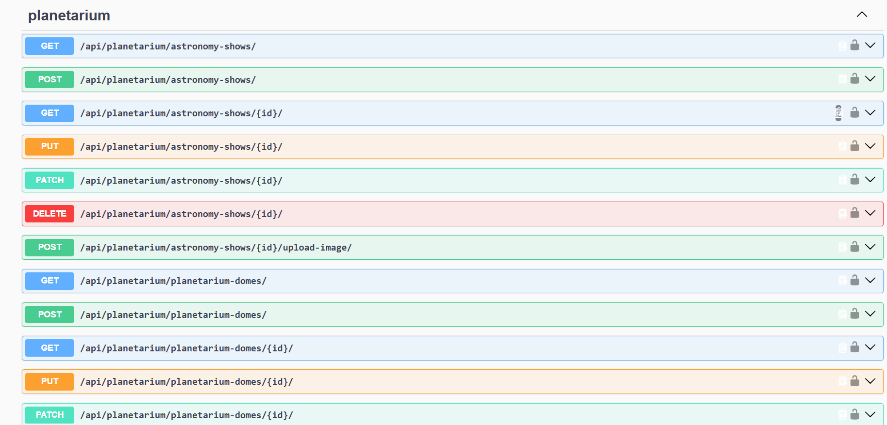

# Planetarium API Service 🌌

Planetarium API Service is a production-ready RESTful web service built with Django REST Framework (DRF) designed for
managing planetarium operations, booking tickets for astronomical shows, managing domes, and handling user reservations.

## 🚀 Key Features

* **Advanced JWT Authentication:**
    * Email-based user identification (without `username`).
    * Token Rotation & Blacklisting enabled.
    * **Reuse Detection & Session Security:** Custom `CustomTokenRefreshSerializer` detects stolen refresh tokens and
      automatically revokes all active sessions for the compromised user.
* **Planetarium Management:**
    * Full management of Astronomy Shows, Show Themes, and Planetarium Domes.
    * Show Session management with dynamic available ticket calculations (`tickets_available`).
    * Image uploading for Astronomy Shows via dedicated endpoints.
* **Reservation & Ticketing System:**
    * Real-time ticket seat allocation with row/seat boundary validation.
    * Atomic transactions for multi-ticket reservations.
* **Role-Based Access Control (RBAC):** Custom `IsAdminOrReadOnly` permissions ensuring safe read-only operations for
  regular users and full modification rights for administrators.
* **Interactive API Documentation:** Integrated OpenAPI documentation generated via `drf-spectacular` (Swagger UI &
  ReDoc).
* **Database Optimization:** Optimized SQL queries utilizing `select_related`, `prefetch_related`, and annotations to
  avoid $N+1$ query issues.

---

## 🛠️ Tech Stack

* **Core Framework:** Python 3.13, Django 6.1, Django REST Framework 3.18
* **Authentication:** SimpleJWT (Customized Token Refresh logic & Blacklist)
* **Database:** PostgreSQL 16.0 (Alpine)
* **Documentation & OpenAPI:** `drf-spectacular` (Swagger & ReDoc)
* **Testing & Formatting:** Django TestCase, `black` (Code Formatter)
* **Containerization:** Docker & Docker Compose

---

## 📁 Project Structure

```text
├── planetarium/          # Core app (Shows, Domes, Sessions, Reservations & Tickets)
├── user/                 # User app (Custom User model, JWT views & Custom Serializers)
├── planetarium_service/  # Project configuration (settings, root URLs, WSGI/ASGI)
├── Dockerfile            # Container configuration
├── docker-compose.yaml   # Multi-container orchestration (Django + PostgreSQL)
└── requirements.txt      # Project dependencies
```

### 🐳 Docker Architecture & Setup

* **Pre-built Image Support:** Ready to pull and run directly
  from [Docker Hub](https://hub.docker.com/r/serhiiambartsumov/planetarium).
* **Database Readiness Handling:** Uses Docker `healthcheck` (or custom `wait_for_db` command) ensuring Django waits for
  PostgreSQL before running migrations and starting the server.
* **Lightweight & Isolated Image:** Optimized `Dockerfile` ensuring minimal container footprint and layer caching.
* **Persistent Storage & Volumes:** Structured handling of static, media files, and PostgreSQL data using named Docker
  volumes (`my_db`, `my_media`, `my_static`).

---

## 🔧 Getting Started & Installation

### Prerequisites

Make sure you have the following installed on your system:

* [Docker Desktop](https://www.docker.com/products/docker-desktop/) (including Docker Compose)
* [Git](https://git-scm.com/)

---

1. **Clone the repository:**
   ```bash
   git clone https://github.com/SerhiiAm/Planetarium-api.git
   cd Planetarium-api
   ```

2. **Configure Environment Variables:**
   Create a `.env` file in the root directory and define your variables:
   ```env
   POSTGRES_HOST=db
   POSTGRES_PORT=5432
   POSTGRES_DB=planetarium
   POSTGRES_USER=planetarium
   POSTGRES_PASSWORD=planetarium
   TAG=v1.0.0
   SECRET_KEY=your_django_secret_key_here
   ```

3. **Build and Run the Containers:**
   Start the application and PostgreSQL database:
   ```bash
   docker compose up --build
   ```

4. **Create a Superuser (Admin):**
   To access the Django Admin or manage system resources:
   ```bash
   docker compose exec app python manage.py createsuperuser
   ```

## 📸 API Documentation Preview



---